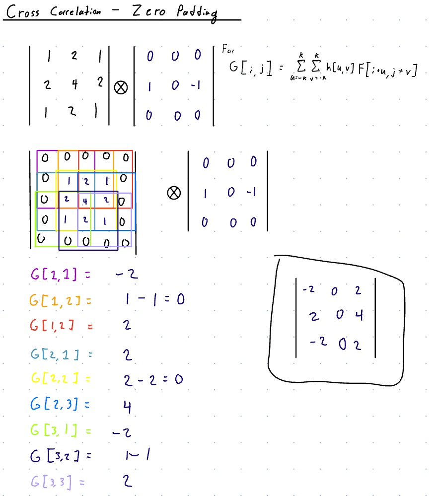

1. 
A) I believe the right number is negative because this filter changes the image from right to left.

B) We would multipy the filter by 1 divided 2 times dx - where dx is te physical distance between pixels in the x direction.
Chat GPT Prompt used "how would we modify image horizontal derivative filters to calculate the slope with correct scale"

C) The top filter would act as if it was a 1X2 filter and take less computation time however it would be less accurate than the bottum filter.

2. 

This filter adds a vertical blur.

3. Using the language of “low-” and “high-frequency” image content, explain why sharpening is not the inverse of blurring, and what it accomplishes instead.

Low-frequency segments of images have almost negligble variation in the channels, therefore these segments can be blurred to compress the image with a similar visualiaztion to our eyes. However, high frequency segments of images have high variations in the channels of the image segments. It is easy to average out the channels to blur an image, however the inverse operation to sharpen a blured image is not intuitive. 

4. Consider the original image of beans on the left, and the processed version on the right. Describe what has changed in terms of frequency content.

The frequency of the image on the left is lower than the frequecy of the image on the right as the variation in the channel is less on the left image as it is blurred. 

5. What’s the maximum frequency (expressed in full periods per pixel) representable in a 1D image (i.e., a row of pixels)? What does such an image look like?

The maximum frequency a 1D image would .5 and this would be an image that alternates between black and white pixels.

6. What’s the minimum frequency representable in a 1D image? What does such an image look like?

The minimum frequency in a 1D image would be 0. This image would be a solid color. 

7. If you walked far away from the image described in #5 until you couldn’t distinguish individual pixels, what would it look like?

The image I described in number 5 would look like gray solid color image. 

8. The sobel filter detects edges in a fairly narrow (heh) sense. If your image is sufficiently high-resolution, a fairly prominent edge might still run across many pixels. For example, at original resolution, the bright left edge of Beans’ ear in the original photo above is probably 10+ pixels wide, so a 3x3 sobel edge detector (or a Canny edge detector) wouldn’t fire very strongly on that edge. Can you devise an approach to edge detection that would find edges at a range of spatial frequencies, rather than just the finest details at the original image’s resolution?

