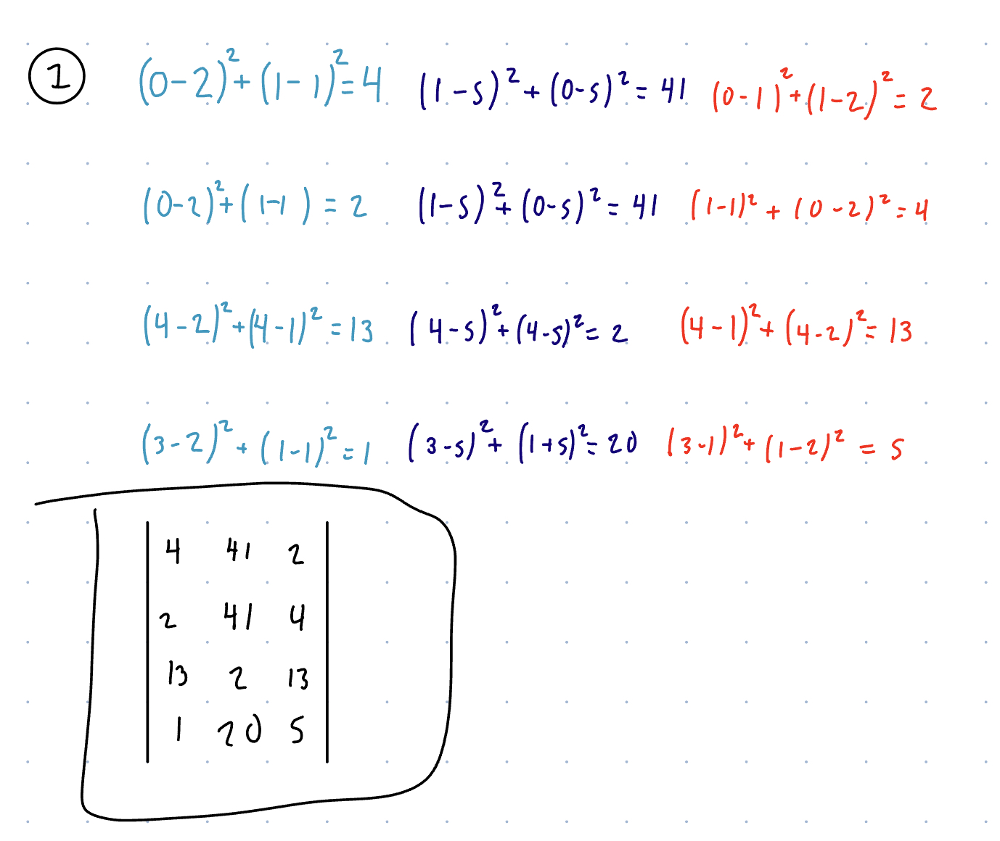
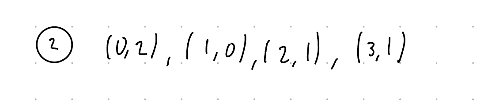
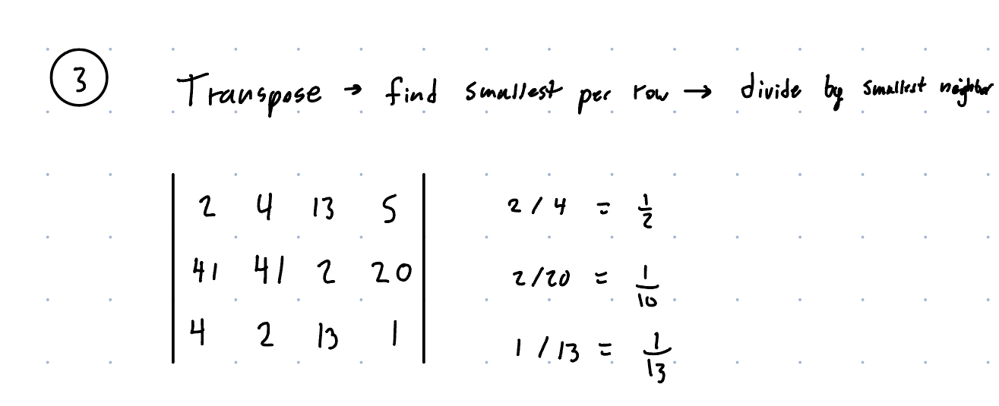

HW7

1. [[4,41,2],[2,41,4],[13,2,13],[1,20,5]]

2. (0,2),(1,0),(2,1),(3,1)

3. 1/2, 1/10, 1/13

4. [1,0,tx], [0,1,ty],[0,0,1]
I used chat gpt for help on this problem.
5. 
Width: max(W1*tx+W2)
Height: max(H1*ty+H2)
